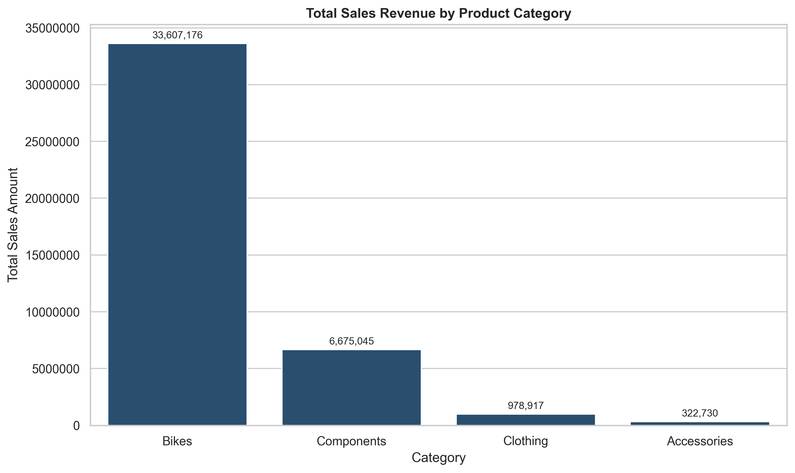
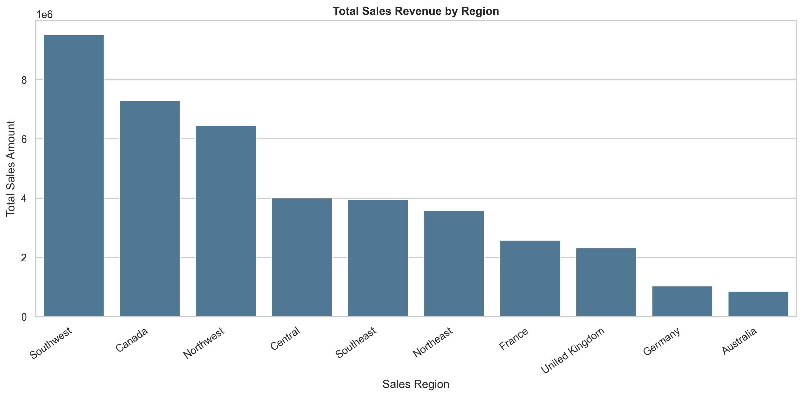
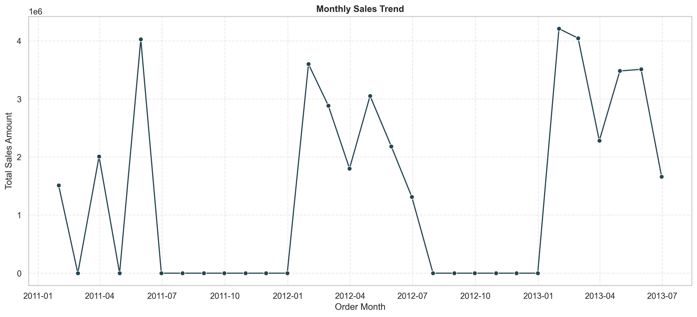

# Retail Sales Performance Analysis

Python-based analysis of retail transaction data across products, categories, regions, promotions, time, and shipment timing.

## Overview

This project analyzes retail transaction-line data to identify sales patterns and operational insights that can support inventory planning, regional prioritization, promotion review, and fulfilment monitoring.

The analysis covers data quality, product performance, regional sales contribution, promotion activity, recorded sales trends, and shipment timing relative to due dates.

> **Important:** The dataset is transaction-line level. One order number can appear in several rows when an order contains multiple products.

---

## Business Questions

- Which categories and products generate the highest sales revenue?
- Which subcategories have the greatest unit demand?
- Which sales regions contribute the most revenue?
- How are sales, units, and discounts distributed across promotions?
- How have recorded sales changed over time?
- What is the time between order placement and shipment?
- Are recorded shipments before, on, or after the due date?

---

## Dataset

The dataset contains retail transaction-line records with product, pricing, promotion, region, quantity, sales, tax, freight, order-date, due-date, and shipment-date fields.

The raw dataset is not included in this repository. To reproduce the analysis, obtain the dataset from its authorized source and save it locally as:

```text
data/raw/Retail.csv
```

See [`data/README.md`](data/README.md) for expected file name, required columns, handling guidance, and reproduction instructions.

See [`docs/data_dictionary.md`](docs/data_dictionary.md) for field definitions and derived metrics used in the notebook.

---

## Tools

- Python
- pandas
- NumPy
- Matplotlib
- seaborn
- SciPy
- Jupyter Notebook

---

## Analytical Workflow

1. Inspect the dataset structure and review the data dictionary.
2. Assess missing values, duplicates, data types, and data consistency.
3. Clean categorical, numeric, and date fields.
4. Create sales, discount, calendar, and shipment-timing metrics.
5. Analyze category, product, subcategory, and regional performance.
6. Compare promotions using sales revenue, units sold, and discount amount.
7. Analyze monthly and yearly recorded sales.
8. Evaluate order-to-ship timing and shipment timing against due dates.
9. Present findings, recommendations, and limitations.

---

## Key Findings

- The cleaned dataset contains **32,009 transaction lines**, representing **1,866 unique orders** and **116,100 units sold**.
- Total recorded sales amount is **41.58 million** across the available dataset.
- **Bikes** generated the highest sales revenue at approximately **33.61 million**, contributing **80.82%** of total recorded sales.
- **Components** ranked second with approximately **6.68 million** in sales revenue, representing **16.05%** of total recorded sales.
- **Mountain-200 Black, 38** was the highest revenue-generating product, with approximately **1.64 million** in recorded sales.
- **Road Bikes** recorded the highest unit demand, with **19,149 units sold**, followed by Mountain Bikes with **12,202 units**.
- The **Southwest** region generated the highest recorded sales revenue at approximately **9.52 million**, representing **22.89%** of total sales.
- Most transaction lines were completed without a discount. Among discounted promotion types, **Volume Discount 11 to 14** generated the highest recorded sales revenue.
- Recorded annual sales totals increased from approximately **7.55 million** in 2011 to **14.84 million** in 2012 and **19.20 million** in 2013. These figures should be interpreted carefully because time coverage may not be comparable across all years.
- The available records show a consistent **7-day order-to-ship interval** and shipment dates that are consistently **5 days before the recorded due date**. This indicates a fixed pattern in the source data rather than a complete measure of delivery performance.

---

## Selected Visuals

### Key Performance Indicators


### Sales Revenue by Category



### Sales Revenue by Region



### Monthly Recorded Sales Trend



Additional visualizations are available in [`reports/figures/`](reports/figures/) and in the analysis notebook.

---

## Recommendations

### Product and inventory strategy

- Prioritize inventory planning for Bikes and other high-revenue categories.
- Monitor high-demand subcategories, particularly Road Bikes and Mountain Bikes, to reduce the risk of stock shortages.
- Review low-demand subcategories using margin, inventory cost, stock availability, and strategic importance before making assortment decisions.

### Regional strategy

- Prioritize inventory allocation, sales planning, and fulfilment capacity in high-revenue regions, especially Southwest, Canada, and Northwest.
- Investigate lower-revenue regions using additional data on customer demand, local marketing activity, fulfilment costs, and product availability.

### Promotion strategy

- Evaluate promotions using sales revenue, units sold, discount amount, and—when available—gross margin and incremental sales.
- Do not define a promotion as profitable based only on sales volume or transaction count.
- Compare promotion performance by category and region to identify where discounts may be most commercially useful.

### Operational strategy

- Treat the shipment-timing result as a source-data pattern rather than proof of operational performance because the order-to-ship and due-date intervals are constant.
- Add actual delivery dates, warehouse data, stock availability, and carrier information in future analyses to assess fulfilment performance more accurately.

---

## Limitations

- The data is transaction-line level; one order number can appear in multiple rows.
- The dataset contains sales amount but does not contain product cost, gross margin, marketing spend, returns, or inventory levels. Therefore, profitability cannot be measured.
- Actual delivery dates are unavailable. The operational analysis measures shipment timing, not delivery completion or customer delivery experience.
- Monthly and yearly comparisons may be affected by incomplete or non-comparable time coverage.
- Some financial variables, including sales, tax, and freight, appear structurally related in the source data. Correlation between them should not be interpreted as causation.
- The constant order-to-ship and ship-versus-due intervals may reflect how the dataset was generated rather than actual operational variation.
- The source, licence, and permitted use of the dataset should be verified before redistribution or real-world decision-making.

---

## Repository Structure

```text
retail-sales-performance-analysis/
├── README.md
├── requirements.txt
├── .gitignore
├── data/
│   ├── README.md
│   ├── raw/
│   │   └── Retail.csv              # Local only; not committed
│   └── processed/
├── notebooks/
│   └── retail_sales_performance_analysis.ipynb
├── reports/
│   └── figures/
├── docs/
│   └── data_dictionary.md
└── src/
    └── README.md
```

---

## How to Run

### 1. Clone the repository

```bash
git clone [https://github.com/abrahamoluwatobiloba/retail-sales-performance-analysis.git](https://github.com/abrahamoluwatobiloba/retail-sales-performance-analysis.git)
cd retail-sales-performance-analysis
```

### 2. Create and activate a virtual environment (recommended)

**Windows Command Prompt:**

```bat
python -m venv .venv
.venv\Scripts\activate
```

### 3. Install dependencies

```bash
pip install -r requirements.txt
```

### 4. Add the dataset

Obtain the authorized dataset and save it with this exact name:

```text
Retail.csv
```

Place it in this folder:

```text
data/raw/Retail.csv
```

### 5. Run the notebook

Start Jupyter:

```bash
jupyter notebook
```

Then open:

```text
notebooks/retail_sales_performance_analysis.ipynb
```

Run all cells from top to bottom.

---

## Related Repositories

- [Oluwatobiloba Data Analysis Portfolio](https://github.com/abrahamoluwatobiloba/Oluwatobiloba-data-analysis-portfolio)
- [GitHub Journey](https://github.com/abrahamoluwatobiloba/github-journey)

---

## Contact

- GitHub: [abrahamoluwatobiloba](https://github.com/abrahamoluwatobiloba)
- LinkedIn: [Oluwatobiloba Abraham](https://www.linkedin.com/in/oluwatobiloba-abraham/)
- Email: [abrahamoluwatobiloba@gmail.com](mailto:abrahamoluwatobiloba@gmail.com)
